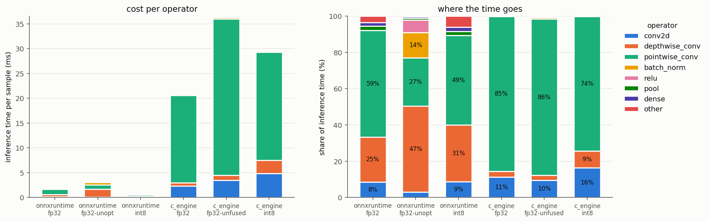
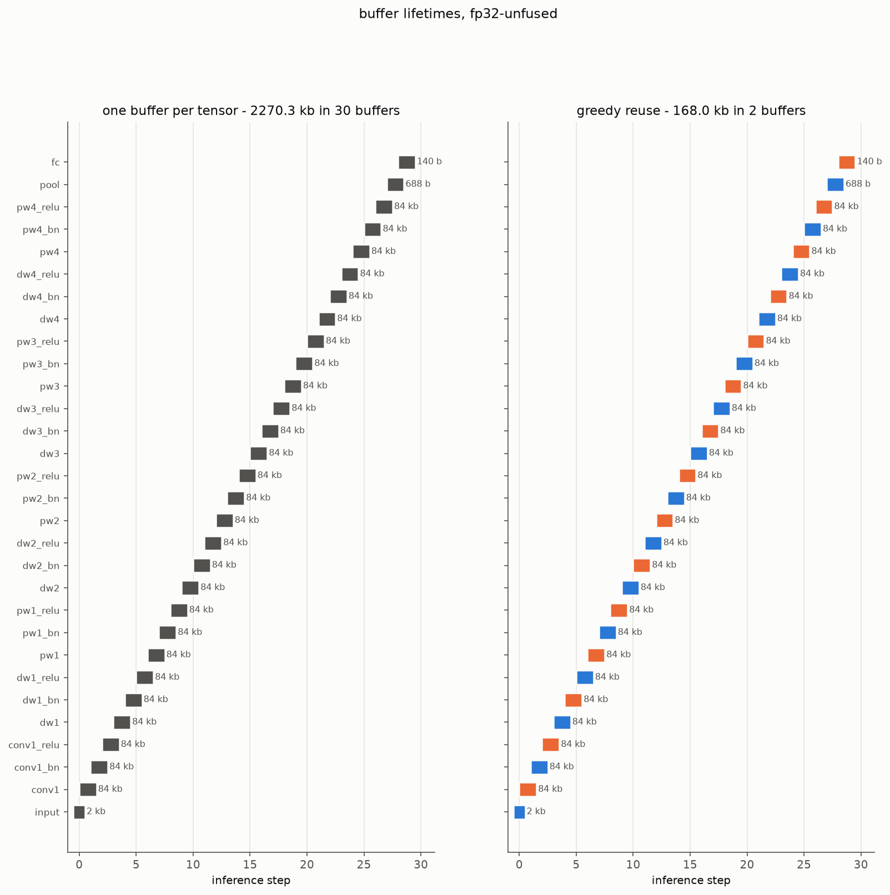
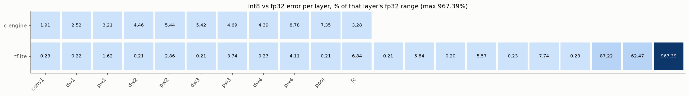

# EdgeInfer

Cross-runtime ML inference benchmark. Takes one model (DS-CNN keyword spotter), runs it through four inference backends, and measures where the time actually goes — per operator, per runtime, down to the memory allocation pattern.

The point isn't "which runtime is fastest" as a headline number. It's understanding *why*: which operators fuse, where quantization helps vs hurts, how each runtime plans memory, and what happens when you strip away the runtime entirely and do it in raw C under embedded constraints.

## Results

DS-CNN, 172 channels, 140,559 parameters, trained 30 epochs on Speech Commands v2
(35 words). Every row is scored on the same 11,005-clip test set with the same
features, batch 1, single threaded, on an i5-8250U laptop.

| Runtime | Accuracy (%) | Latency p50 (ms) | Model size (KB) | Peak RAM (KB) | Kernels run |
|---------|-------------|-------------------|-----------------|---------------|-------------|
| PyTorch (reference) | 93.98 | 4.72 | 549 | — | — |
| ONNX Runtime FP32 | 93.98 | 1.63 | 568 | — | 13 |
| ONNX Runtime FP32, optimizations off | 93.98 | 2.68 | 568 | — | 30 |
| ONNX Runtime INT8 | 93.98 | 0.46 | 182 | — | 16 |
| C engine FP32 | 93.98 | 19.37 | 543 | 168 | 11 |
| C engine FP32, unfused | 93.98 | 40.78 | 549 | 168 | 29 |
| C engine INT8 | 94.00 | 29.08 | 148 | 42 | 11 |
| TFLite | not run | | | | no TensorFlow on this machine |
| TensorRT FP16 / INT8 | not run | | | | GPU is Maxwell, TensorRT 11 needs Turing or newer |

Peak RAM is the C engine's own planner arena, which is exact. ONNX Runtime
exposes no equivalent figure; `results/tables/memory.md` says how each runtime's
number was obtained.

**On the Cortex-M4 target** (QEMU mps2-an386, instruction counts under `-icount`,
both weight sets compiled in):

| | INT8 | FP32, soft float |
|---|---|---|
| Inference | 132.8 M instructions | 1098.1 M instructions |
| Fixed-point MFCC | 10.2 M instructions | 10.2 M instructions |
| Arena, planner vs naive | 42.0 vs 189.6 KB | 168.0 vs 758.6 KB |
| Prediction on a real test clip | correct | correct |

Flash 738.7 KB of 1024 KB, RAM 184.2 KB of 256 KB.

### What the numbers say

**Fusion pays for itself, and it is free.** Folding BN into the convolution and
clamping ReLU on the output write is worth 2.1x in the C engine (40.8 -> 19.4 ms)
and 1.65x in ONNX Runtime (2.68 -> 1.63 ms). The unfused ONNX Runtime profile
shows why: batch norm is 13.8% of the time and ReLU another 7.0%, and both
disappear entirely. Logits move by 8.3e-6 (C) and 2.6e-6 (ORT), i.e. float
rounding from a different summation order — the algebra is exact, as expected.

**Whether INT8 is faster depends entirely on the machine.** On the Cortex-M4 with
no FPU it is 8.3x cheaper than soft-float FP32, which is the whole reason
quantization exists for microcontrollers. On x86, ONNX Runtime's INT8 kernels are
3.5x faster than its FP32 — but the C engine's INT8 is *slower* than its own FP32
(29.1 vs 19.4 ms), because straightforward integer code with a requantization per
output loses to float that the compiler auto-vectorizes with AVX2. INT8 is a
memory and energy win first; the speed depends on having kernels that exploit it.

**Quantization cost essentially no accuracy.** The C engine's INT8 path scores
94.00% against 93.98% for FP32, and ONNX Runtime's INT8 flips 93 of 11,005
predictions while getting exactly as many right. Per-layer error does accumulate
— from 1.9% of the layer's range at conv1 to 8.8% at pw4 — but the argmax
survives it.

**The memory planner is what makes FP32 fit a microcontroller.** One buffer per
tensor needs 758.6 KB, which does not fit in 256 KB of RAM. Liveness analysis plus
greedy reuse brings that to 168 KB in two ping-pong buffers. Run it unfused and
the naive figure is 2.27 MB, 13.5x the planned one.

**Time concentrates in the pointwise convolutions**: 86% of the C engine's FP32
time and 59% of ONNX Runtime's, which matches their share of the multiply-adds.
The exception is the first layer, 11% of C engine time for 5% of the MACs — its
dot product runs over a single input channel, so nothing vectorizes.

**Fixed-point MFCC tracks librosa to 0.017 dB on average** over real clips, with a
1.85 dB worst case in near-silent frames, where the Q15 FFT's rounding noise is
comparable to the signal itself.





More in `results/tables/`: the full per-operator breakdown, fusion decisions per
runtime, memory plans and the MFCC error per coefficient.

Latency is measured on a throttling laptop CPU: p50 over 200-300 runs, and the
same binary can vary by up to 2x between runs when the machine is hot. The
relative comparisons hold; the absolute milliseconds are specific to this machine.

## What this does

```
Speech Commands dataset (35 keywords)
         |
    DS-CNN (PyTorch)
         |
    +---------+-----------+-----------+------------+
    |         |           |           |            |
  ONNX    TFLite    TensorRT     C engine
 Runtime              (GPU)     (from scratch)
    |         |           |           |
    +--- operator-level profiling ---+
    |         |           |           |
    +--- INT8 quantization ----------+
    |                     |           |
    +--- fusion analysis -+--- manual fusion
    |         |           |           |
    +--- memory timeline visualization -+
                          |
                   ARM cross-compile
                   QEMU Cortex-M4 test
                   256KB RAM constraint
```

### The four runtimes

**ONNX Runtime** — CPU, the baseline everyone uses. Graph optimizations on by default, quantization via onnxruntime quantization tools. This is what "just ship it" looks like.

**TFLite** — the mobile/edge standard. Flatbuffer format, built-in INT8 with representative dataset calibration. Interesting because its quantization pipeline is the most mature and the operator coverage is the most restrictive.

**TensorRT** — GPU, and the only runtime here that fuses aggressively on its own. Implemented and wired into the benchmark, but not measured: TensorRT 11 needs a Turing or newer card and the machine this ran on has a Maxwell one. Its INT8 story also changed under it — implicit quantization and the calibration cache are gone, so precision now comes from the tensor types in the ONNX file.

**Custom C engine** — no framework, no runtime, no graph. You write the forward pass operator by operator in C, manage memory yourself, implement quantization by hand. This is the floor for dependencies and the ceiling for understanding what's actually happening.

### The model

DS-CNN (Depthwise Separable CNN) from the ARM ML zoo / keyword spotting literature. Small enough to fit on a Cortex-M4 (target: 256KB RAM, 1MB flash), complex enough to have interesting operator patterns (depthwise conv, pointwise conv, batch norm, ReLU, pooling, dense).

Input: 49x10 MFCC features from 1-second audio clips.

Why this model: it's the standard embedded keyword spotting architecture, it's well-studied so you can validate your numbers, and it has a good mix of operator types for profiling.

## What you measure

### Per-operator profiling

Not just "inference took 12ms." For each runtime:

- Time per operator type (conv2d, depthwise_conv, batch_norm, relu, pool, dense)
- Percentage of total inference time per operator
- Memory allocated per operator
- Where fusion happened (which operators got merged and what the fused kernel timing is vs unfused)

The output is a breakdown table and a stacked bar chart showing where time goes in each runtime.

### INT8 quantization comparison

Each runtime quantizes differently. You measure:

- Accuracy drop from FP32 baseline (on Speech Commands test set)
- Inference speedup
- Model size reduction
- Per-operator error accumulation (run FP32 and INT8 side by side, measure divergence layer by layer)

The C engine does quantization manually: you implement `quantize_tensor()`, `dequantize_tensor()`, and a quantized matmul. This is where you learn what the frameworks hide.

### Operator fusion analysis

TensorRT fuses automatically. The C engine fuses manually. The others don't fuse much. You compare:

- Which operators TensorRT chose to fuse (extract from the engine log)
- Manual Conv+BN+ReLU fusion in C: fold BN weights into conv weights at export time, fuse the ReLU as a clamp on the output
- Speedup from fusion (fused vs unfused timing on the same code path)
- Numerical difference between fused and unfused (should be zero for BN folding, verify it)

### Memory planning

Each runtime allocates intermediate buffers differently. You build:

- A liveness analysis: for each tensor, when it's first written and last read
- A memory timeline visualization showing buffer lifetimes
- Your own greedy allocator in the C engine that reuses dead buffers
- Comparison: peak memory with naive allocation vs your planner vs what each runtime actually uses

The visualization is a Gantt-style chart with tensors on the y-axis and inference steps on the x-axis, colored by which physical buffer backs each tensor.

### Embedded constraint simulation

The C engine compiles for ARM Cortex-M4 via `arm-none-eabi-gcc` and runs under QEMU:

- Does it fit in 256KB RAM? If not, what's the minimum with the memory planner?
- Does the binary fit in 1MB flash?
- Cycle count on QEMU (not real hardware timing, but relative operator cost)
- Fixed-point MFCC preprocessing in C (no floating point on the target)

## Preprocessing: fixed-point MFCC in C

The embedded target has no FPU, so preprocessing can't use `librosa`. You implement:

- 16-bit PCM input handling
- Fixed-point FFT (Q15 format, radix-2 Cooley-Tukey)
- Mel filterbank application in fixed-point
- Log compression using a lookup table
- DCT for the final MFCC coefficients

Validated against librosa output on the same audio clips: max absolute error per coefficient, plotted as a heatmap across time frames and mel bins.

## Project structure

```
edgeinfer/
├── README.md
├── train/
│   ├── ds_cnn.py              # model definition
│   ├── train.py               # training loop, speech commands
│   └── export.py              # onnx, tflite, tensorrt export
├── runtime/
│   ├── onnx_runner.py         # onnx runtime inference + profiling
│   ├── tflite_runner.py       # tflite inference + profiling
│   ├── tensorrt_runner.py     # tensorrt inference + profiling hooks
│   └── profile.py            # unified profiling interface
├── c_engine/
│   ├── include/
│   │   ├── tensor.h           # tensor struct, memory layout
│   │   ├── ops.h              # operator declarations
│   │   ├── quantize.h         # int8 quantization utils
│   │   └── memory.h           # buffer allocator
│   ├── src/
│   │   ├── ops/
│   │   │   ├── conv2d.c       # direct convolution, no im2col
│   │   │   ├── depthwise.c    # depthwise separable conv
│   │   │   ├── dense.c        # fully connected
│   │   │   ├── pool.c         # average pooling
│   │   │   └── fused.c        # conv+bn+relu fused kernel
│   │   ├── quantize.c         # manual int8 quant/dequant
│   │   ├── memory.c           # liveness analysis + greedy allocator
│   │   ├── mfcc.c             # fixed-point mfcc extraction
│   │   └── forward.c          # the full forward pass, wired together
│   ├── weights/               # exported numpy arrays -> C headers
│   ├── test/
│   │   └── test_ops.c         # operator-level unit tests
│   ├── Makefile               # native + cross-compile targets
│   └── link.ld               # linker script for memory constraints
├── analysis/
│   ├── compare_runtimes.py    # generates the comparison tables
│   ├── fusion_analysis.py     # extracts and compares fusion decisions
│   ├── memory_timeline.py     # liveness + allocation visualization
│   └── quant_error.py         # layer-by-layer quantization error
├── embedded/
│   ├── startup.s              # minimal cortex-m4 startup
│   ├── qemu_run.sh            # qemu invocation
│   └── constraints.py         # checks ram/flash fit
├── data/
│   └── speech_commands.py     # dataset download + preprocessing
├── results/
│   ├── profiling/             # raw timing data, json
│   ├── plots/                 # generated figures
│   └── tables/                # markdown comparison tables
├── tests/
│   ├── test_export.py
│   ├── test_mfcc.py           # librosa vs c implementation
│   └── test_quant.py          # fp32 vs int8 numerical checks
├── Makefile
├── Dockerfile
├── .github/workflows/ci.yml
└── requirements.txt
```

## How it was built

### Phase 1 — model and baselines

Trained DS-CNN on Speech Commands v2: 30 epochs on a laptop CPU, 93.98% on the
test set. Exported to ONNX, confirmed ONNX Runtime reproduces PyTorch to 1e-7,
and built the profiling harness so every operator is timed individually.

**What you learn**: ONNX export mechanics, operator naming conventions, how
PyTorch ops map to ONNX ops (some don't map 1:1 and you'll hit that — the dynamo
exporter folds batchnorm before any runtime sees the graph).

### Phase 2 — runtimes

TFLite conversion from ONNX through onnx2tf, TensorRT engines from the same
graph. Both are written and wired into `make bench`; neither ran on this machine,
for lack of TensorFlow and of a recent enough GPU.

**What you learn**: the conversion quirks of each runtime (TFLite's
quantization-aware restrictions, TensorRT's layer fusion log, operator support
gaps, and APIs that disappear between major versions).

### Phase 3 — C engine

Wrote the forward pass in C, operator by operator, FP32 first. Every operator is
tested against PyTorch output, and the assembled pass reproduces PyTorch's
accuracy across the whole test set.

**What you learn**: what a convolution actually does when you can't call
`torch.nn.Conv2d`. How depthwise separable convs work at the memory layout level.
What batch normalization is when you fold it into weights.

### Phase 4 — quantization

INT8 for the paths that run here: ONNX Runtime's `quantize_static`, and manual
quantization in C that is bit-exact against a Python reference. The same
calibration feeds the Q/DQ graph TensorRT would consume.

**What you learn**: per-channel vs per-tensor quantization, calibration
strategies, where quantization error accumulates (1.9% of range at the first
layer, 8.8% by the last) and why the argmax survives it anyway.

### Phase 5 — fusion and memory

Conv+BN+ReLU fusion in the C engine, worth 2.1x. A liveness analyzer and greedy
allocator that cut the FP32 arena from 758 KB to 168 KB, with the timeline plots
to show which buffer backs which tensor.

**What you learn**: why BN folding is mathematically exact (not an
approximation), how liveness analysis works on a dataflow graph, how runtime
memory planners trade peak RAM for allocation complexity.

### Phase 6 — embedded

Cross-compiled for Cortex-M4, wrote the fixed-point MFCC, ran it under QEMU:
738.7 KB of flash, 184.2 KB of RAM, and the right answer on a real clip.

**What you learn**: cross-compilation toolchain, fixed-point arithmetic (Q15
format, overflow handling), what "no FPU" means in practice (8.3x), linker
scripts and memory regions.

### Phase 7 — analysis and writeup

Generated the comparison tables and figures in `results/`. The README opens with
them, not with architecture.

## Hardware requirements

Everything except TensorRT runs on a CPU. The results above came off a four-core
i5-8250U laptop, which is slow but sufficient: 5.5 minutes per training epoch,
and the whole benchmark pass takes minutes.

- **CPU**: any x86_64. Training is the only slow part — about 2.5 hours for 30
  epochs on four cores, minutes on a GPU.
- **GPU**: only for TensorRT, and it must be Turing or newer, since TensorRT 11
  dropped Maxwell and Pascal.
- **RAM**: 4GB is enough. The audio caches are memory-mapped, so the dataset
  never has to fit in memory.
- **Disk**: ~6GB — 2.4GB for the archive and 3.4GB for the caches.
- **Cross-compiler**: `arm-none-eabi-gcc`, from apt or from ARM's prebuilt
  tarball if you have no root on the machine.
- **QEMU**: `qemu-system-arm` 5.2 or newer, for the `mps2-an386` Cortex-M4 machine.

No external hardware, no dev board. The Makefile assumes a POSIX shell: Linux,
or WSL if you are on Windows.

## Running it

```bash
pip install -r requirements.txt          # python 3.12 or 3.13, linux x86_64
sudo apt install gcc-arm-none-eabi libnewlib-arm-none-eabi qemu-system-arm
make help                                # every target, one line each
```

Full run, in order:

```bash
make data        # download speech commands v2 (2.4 GB) and cache the audio
make train       # train ds-cnn, writes artifacts/ds_cnn.pt
make export      # onnx, tflite, tensorrt engines, c headers, eval + calibration sets
make c-engine    # build the c cli, run the operator tests
make bench       # every runtime this machine can run -> results/profiling/*.json
make qemu        # cortex-m4 build, flash/ram check, instruction counts
make analysis    # tables in results/tables, figures in results/plots
make test        # python tests
```

Nothing after `make export` needs the dataset again: every runner reads the same
evaluation features from `artifacts/`, so all seven rows of the comparison table
are scored on identical inputs.

Without a dataset or a GPU you can still exercise the whole pipeline:

```bash
make smoke-export c-engine test qemu analysis
```

That path is what CI runs, using an untrained model and synthetic features.

### What runs where

| Piece | Needs |
|-------|-------|
| training, export, onnx runtime, c engine | cpu only |
| tflite export and runner | tensorflow (cpu is fine) |
| tensorrt engines and runner | nvidia gpu, driver with cuda 13 support |
| `make qemu` | `arm-none-eabi-gcc`, `qemu-system-arm` 5.2+ (needs the mps2-an386 machine) |
| tflite per-operator timings | `make tools`, which fetches tflite's `benchmark_model` |

## Notes on the implementation

Decisions that are worth knowing before reading the code, mostly places where
reality did not match the plan.

**TensorRT 11 removed implicit quantization.** `IInt8Calibrator` and the whole
calibration-cache workflow are gone, and so are `BuilderFlag.FP16` and
`BuilderFlag.INT8`: every network is strongly typed now, so precision comes from
the tensor types in the ONNX file. FP16 is therefore a cast copy of the graph,
and INT8 is a Q/DQ graph calibrated by ONNX Runtime's `quantize_static`. One
calibration run, symmetric int8 with float biases, feeds TensorRT; the asymmetric
uint8 variant feeds ONNX Runtime's x86 kernels, which prefer it.

**The ONNX export deliberately uses the TorchScript exporter.** The dynamo
exporter's optimizer folds batchnorm into conv before any runtime sees the graph,
which would hide exactly the fusion decisions this project is trying to measure.
`training=PRESERVE` keeps one node per module: conv, batchnorm, relu. Both graphs
are exported, and `fusion_analysis.py` prints the difference, because "your
exporter already fused it" is itself a result.

**Features are normalized outside the model.** MFCC coefficient 0 spans roughly
-630 to +60 dB while the rest sit within a few tens of dB. Quantizing that to one
int8 tensor would spend the whole range on c0 and leave three bits for everything
else, so per-coefficient mean/std normalization happens in preprocessing and the
stats travel in the checkpoint. The fixed-point MFCC applies the same
normalization on the target, as one requantization per coefficient.

**MFCC parameters** are 16 kHz, 512-point FFT, 320 hop, 40 mel bands from 20 Hz
to 4 kHz, 10 coefficients, 49 frames, Slaney mel scale, no `top_db` clipping.
`data/speech_commands.py` is the single source of truth: training, every runtime
and the Q15 tables in `c_engine/weights/mfcc_tables.h` all come from it.

**Peak RAM is not one measurement.** The C engine reports its planner's arena
exactly, TensorRT reports the engine's device memory, TFLite reports
`benchmark_model`'s footprint, and ONNX Runtime has no such API so it reports the
process RSS high-water delta, which includes the runtime itself. The comparison
table prints the source next to the number instead of pretending they match.

**QEMU timing is instruction counts, not cycles.** With `-icount shift=0` every
instruction takes 1 ns of virtual time and the 25 MHz SysTick advances one tick
per 40 instructions, which was calibrated against a loop of known length. That
makes per-operator costs deterministic and reproducible, but they are not
hardware cycles: no wait states, no flash latency, no pipeline effects.

## What you understand after this

- What an inference runtime actually does (graph optimization, memory planning, kernel dispatch) and what it hides from you
- INT8 quantization from both sides: the API and the math
- Operator fusion: why it works, when it's exact, and when it introduces error
- Memory management for inference: liveness, allocation, the peak-RAM tradeoff
- Embedded ML constraints: no heap, no FPU, fixed flash/RAM budgets
- Cross-compilation and hardware emulation
- The real performance/accuracy/size tradeoff triangle that governs every deployment decision

This is the project you explain when someone asks "what happens between `model.export()` and inference on a device."

## References

The model and the dataset both come from the keyword spotting literature, and
the int8 arithmetic follows the scheme every mobile runtime uses.

- P. Warden, *Speech Commands: A Dataset for Limited-Vocabulary Speech
  Recognition*, [arXiv:1804.03209](https://arxiv.org/abs/1804.03209) (2018).
  Released under CC-BY 4.0. Not redistributed here — `make data` downloads it.
- Y. Zhang, N. Suda, L. Lai, V. Chandra, *Hello Edge: Keyword Spotting on
  Microcontrollers*, [arXiv:1711.07128](https://arxiv.org/abs/1711.07128) (2017).
  The DS-CNN architecture, also published in the
  [ARM ML zoo](https://github.com/ARM-software/ML-zoo).
- B. Jacob et al., *Quantization and Training of Neural Networks for Efficient
  Integer-Arithmetic-Only Inference*,
  [arXiv:1712.05877](https://arxiv.org/abs/1712.05877) (2017). The int8 scheme
  the C engine implements by hand: per-channel symmetric weights, asymmetric
  activations, and a fixed-point multiplier per output channel.

The MFCC reference implementation is checked against
[librosa](https://librosa.org/), and the TFLite per-operator numbers come from
TensorFlow Lite's own `benchmark_model`.

## License

MIT, see [LICENSE](LICENSE).

## Status

All seven phases are implemented, and the results above come from a trained model
scored on the full test set, not a smoke run.

- **Training** — 30 epochs on CPU, 94.71% validation, 93.98% test across 35 words.
  The log is in `results/train.log`.
- **C engine** — 24 operator tests pass. INT8 kernels are bit-exact against the
  Python reference in `train/quant.py`, FP32 is within 1.5e-7 of PyTorch, and all
  three modes reproduce PyTorch's accuracy on the full test set.
- **ONNX Runtime** — matches PyTorch to 1e-7 in FP32. Its INT8 model is genuinely
  quantized, not silently float: logits move by up to 2.7 and 93 of 11,005
  predictions flip.
- **Cortex-M4** — cross-compiles, links inside the budget, runs under QEMU and
  classifies a real test clip correctly in both INT8 and soft-float FP32.
- **Fixed-point MFCC** — 0.017 dB mean error against librosa on real recordings.

Not run here: TFLite, which needs TensorFlow, and TensorRT, which needs a Turing
or newer GPU. Both paths are written and wired into `make bench`, which picks up
whichever runtimes a machine can actually run.
